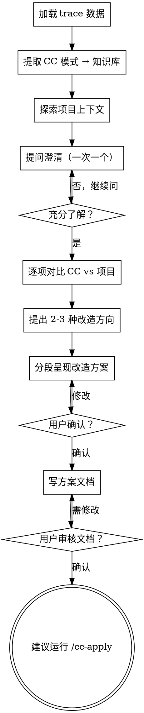

# CC Learn

从 cc-trace 的原始抓包数据中提取 Claude Code 的 context engineering 模式，对比分析当前项目的实现，通过协作式对话与用户一起制定改造方案。

<HARD-GATE>
改造方案未经用户确认，不得建议运行 /cc-apply。每个阶段的产出都需要用户确认后才能进入下一阶段。
</HARD-GATE>

## Checklist

你必须为以下每个步骤创建 task 并按序完成：

1. **[Phase 1] 加载 trace 数据** — 读取 docs/cc-context/traces/ 中的原始 JSONL
2. **[Phase 1] 提取 CC 模式** — 用 jq 分析 trace，提取模式写入知识库
3. **[Phase 2] 探索项目上下文** — 扫描当前项目的 agent 相关代码
4. **[Phase 2] 提问澄清** — 一次一个问题，了解项目架构意图、约束、优先级
5. **[Phase 3] 逐项对比** — CC 模式 vs 项目现状，标记状态
6. **[Phase 4] 提出 2-3 种改造方向** — 带权衡分析和推荐
7. **[Phase 4] 呈现改造方案** — 分段展示，每段确认后再继续
8. **[Phase 4] 写方案文档** — 保存到 docs/cc-context/YYYY-MM-DD-migration-plan.md
9. **[Phase 4] 用户审核** — 确认后才建议运行 /cc-apply

## 流程图



**终态是建议运行 /cc-apply。** 不得直接开始改代码。

## Phase 1: 加载与提取

### 输入来源

读取 cc-trace 保存的原始数据（按优先级）：

1. `docs/cc-context/traces/` 目录中的 JSONL 文件（用 Glob 找最新的）
2. 用户指定的 JSONL 文件路径
3. 用户粘贴的原始 trace 数据

如果没有找到输入，告诉用户先运行 `/cc-trace`。

### 分析命令

使用 jq 从 JSONL 中提取关键信息（仅过滤 LLM 请求）：

```bash
LLM='select(.request.url | test("v1/messages"))'
```

针对每个类别提取：

- **系统提示词架构**: block 数量、长度、cache_control 位置、内容分段
- **工具设计**: 工具名、描述风格、参数 schema、deferred tools
- **上下文管理**: context_management 配置、消息增长趋势
- **缓存策略**: cache_control 放置模式、ephemeral 标记
- **思考与推理**: thinking 配置、budget_tokens、effort 级别
- **消息模式**: system-reminder 注入、角色分布
- **模型路由**: model 选择、max_tokens 设置

### 知识库

提取的模式写入 `docs/cc-context/patterns/` 知识库，按主题组织：

| 文件 | 主题 |
|------|------|
| `system-prompt-design.md` | 系统提示词分层、block 组织、cache_control 放置 |
| `tool-engineering.md` | 工具定义、命名规范、参数 schema、deferred tools |
| `context-management.md` | 上下文压缩、消息裁剪、context_management API |
| `agent-orchestration.md` | 子 agent 模式、Agent 工具设计、并行调度 |
| `thinking-reasoning.md` | thinking 配置、budget_tokens、effort 控制 |
| `message-patterns.md` | system-reminder 注入、角色管理、工具调用模式 |
| `model-routing.md` | 模型选择、max_tokens 设置、模型切换 |

只有发现了相关模式时才创建对应文件。

#### 模式条目格式

```markdown
### <模式名称>

- **CC 做法**: 具体描述观察到的行为
- **证据**: 关键 trace 数据摘录（简洁）
- **为什么**: 设计原理
- **来源**: CC 版本、trace 日期

---
```

#### 增量更新

- 新 trace 添加新模式或更新现有模式
- 已有模式不会被自动删除
- 每个模式追踪来源版本
- 如果新 trace 与现有模式矛盾，标记冲突并询问用户

提取完成后向用户展示摘要：

```
模式提取完成！
  新增模式:     X
  更新模式:     Y
  未变化:       Z
  知识库:       docs/cc-context/patterns/
```

分类参考见 [references/pattern-taxonomy.md](references/pattern-taxonomy.md)。

## Phase 2: 探索与澄清

### 扫描项目代码

用 Grep 和 Glob 扫描当前项目的 agent 相关代码，**不硬编码路径**：

**文件模式:**
- `**/agent/**`, `**/llm/**`, `**/ai/**`, `**/chat/**`
- `**/*prompt*`, `**/*context*`, `**/*tool*`
- `**/*completion*`, `**/*message*`

**代码模式:**
- 系统提示词构造: `system`, `system_prompt`, `system_message`
- 工具/函数定义: `tools`, `functions`, `function_call`, `tool_choice`
- 上下文管理: `context`, `token`, `truncat`, `compac`, `compress`
- LLM API 调用: `messages.create`, `chat.completions`, `anthropic`, `openai`
- Agent 编排: `agent`, `subagent`, `delegate`, `spawn`

构建已发现组件的映射：文件路径、功能描述、对应的 agent 行为方面。

**如果没找到 agent 相关代码**，停下来告诉用户：

> 这个项目不包含 agent 或 LLM 集成代码。cc-learn 适用于包含 LLM API 调用的项目（系统提示词、工具定义、上下文管理等）。如果项目确有 agent 代码，请指定子目录路径。

不要生成一堆 "not applicable" 条目。

### 提问澄清

理解项目后，**一次一个问题**地向用户澄清：

- 项目使用的 LLM API 格式（Anthropic / OpenAI / 其他）
- 最关注的改造方向（性能？成本？质量？）
- 项目的架构约束和限制
- 优先级偏好

**规则:**
- 每条消息只问一个问题
- 尽可能用多选题
- 开放式问题也可以，但优先多选
- 聚焦于：目的、约束、成功标准

## Phase 3: 对比分析

### 逐项对比

对知识库中的每个模式，评估项目现状：

| 状态 | 含义 |
|------|------|
| `implemented` | 项目已有等效功能 |
| `partial` | 有相关代码但缺少关键方面 |
| `missing` | 未实现 |
| `not-applicable` | 不适用于该项目架构 |

对 `partial` 和 `missing` 的模式，记录：
- **当前状态**: 项目现在怎么做的（附文件路径）
- **CC 做法**: Claude Code 怎么做的
- **差距**: 具体差什么
- **优先级**: HIGH / MED / LOW
- **复杂度**: S / M / L

## Phase 4: 方案制定

### 提出改造方向

基于对比结果，提出 **2-3 种改造方向**，每种包含：

- **方向名称**: 简要概括
- **覆盖范围**: 涉及哪些模式
- **权衡**: 优缺点
- **工作量估算**: 大致规模
- **推荐理由**（如果是推荐项）

先展示推荐方向并说明理由。

### 分段呈现改造方案

用户选定方向后，**分段展示**详细方案：

- 每段覆盖一个主题（如系统提示词、工具设计等）
- 每段展示后询问用户确认
- 包含具体的文件路径、修改点、代码示例
- 用户可以调整后再继续

### 写方案文档

所有段确认后，写入 `docs/cc-context/YYYY-MM-DD-migration-plan.md`（日期时间戳放前面，方便归档排序）：

```markdown
# CC Migration Plan

生成时间: YYYY-MM-DD
知识库: docs/cc-context/patterns/
目标项目: <project root>

## 总览

| 状态 | 数量 |
|------|------|
| 已实现 | X |
| 部分实现 | Y |
| 未实现 | Z |
| 不适用 | W |

对齐度: X / (X + Y + Z) = XX%

## 改造方向

<选定的方向及理由>

## 改造项

### 1. <改造项名称>

- **对应 CC 模式**: <模式名>
- **当前状态**: <partial / missing>
- **当前实现**: <项目现在怎么做>
- **目标实现**: <改造后应该怎样>
- **涉及文件**: <file paths>
- **具体步骤**:
  1. ...
  2. ...
- **优先级**: HIGH / MED / LOW
- **复杂度**: S / M / L

### 2. ...

## 已实现模式

（简要列表）

## 不适用模式

（简要列表及原因）
```

### 用户审核

文档写完后提示：

> 方案已保存到 `docs/cc-context/YYYY-MM-DD-migration-plan.md`。请审核方案内容，确认后运行 `/cc-apply` 开始执行改造。

等待用户确认。如果需要修改，更新文档。

## 关键原则

- **一次一个问题** — 不堆砌
- **多选优先** — 降低用户负担
- **2-3 方案对比** — 不直接给唯一答案
- **分段确认** — 不一口气输出整个方案
- **Hard Gate** — 方案未确认不进 cc-apply
- **无框架假设** — 分析实际代码，不假设使用特定框架
- **API 格式感知** — 支持 Anthropic 和 OpenAI 格式
- **尊重项目惯例** — 建议遵循项目现有代码风格
- **具体可操作** — 指向具体文件、函数、代码模式
