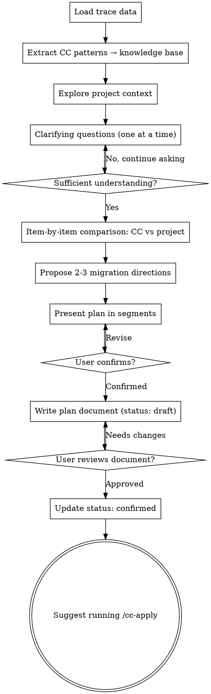

# CC Learn

Extract Claude Code's context engineering patterns from raw trace data captured by cc-trace, compare them against the current project's implementation, and collaboratively develop a migration plan with the user through interactive dialogue.

For data path and format conventions, see [../shared/data-contracts.md](../shared/data-contracts.md).

<HARD-GATE>
Do not suggest running /cc-apply until the migration plan is confirmed by the user. Each phase's output must be confirmed by the user before proceeding to the next phase.
</HARD-GATE>

## Checklist

You must create a task for each of the following steps and complete them in order:

1. **[Phase 1] Load trace data** — Read raw JSONL from docs/cc-context/traces/
2. **[Phase 1] Extract CC patterns** — Analyze traces with jq, write patterns to knowledge base
3. **[Phase 2] Explore project context** — Scan the current project's agent-related code
4. **[Phase 2] Clarifying questions** — One question at a time, understand architecture intent, constraints, priorities
5. **[Phase 3] Item-by-item comparison** — CC patterns vs project status, mark each pattern's state
6. **[Phase 4] Propose 2-3 migration directions** — With trade-off analysis and recommendation
7. **[Phase 5] Present migration plan** — Show in segments, confirm each segment before continuing
8. **[Phase 5] Write plan document** — Save to docs/cc-context/YYYY-MM-DD-migration-plan.md, set status to draft
9. **[Phase 5] User review** — Update status to confirmed after user approval, then suggest running /cc-apply

## Flowchart



**The terminal state is suggesting /cc-apply.** Do not start modifying code directly.

## Phase 1: Load and Extract

### Input Sources

Read raw data saved by cc-trace (in priority order):

1. JSONL files in `docs/cc-context/traces/` directory (use Glob to find the latest)
2. User-specified JSONL file path
3. Raw trace data pasted by the user

If no input is found, tell the user to run `/cc-trace` first.

### Analysis Commands

Use jq to extract key information from JSONL. For jq command reference, see [../shared/trace-inspection.md](../shared/trace-inspection.md).

Extract for each category (use the LLM filter and jq commands from the trace inspection reference):

- **System prompt architecture**: Block count, length, cache_control placement, content segmentation
- **Tool design**: Tool names, description style, parameter schemas, deferred tools
- **Context management**: context_management config, message growth trends
- **Caching strategy**: cache_control placement patterns, ephemeral markers
- **Thinking and reasoning**: thinking config, budget_tokens, effort levels
- **Message patterns**: system-reminder injection, role distribution
- **Model routing**: model selection, max_tokens settings

### Knowledge Base

Write extracted patterns to `docs/cc-context/patterns/` knowledge base, organized by topic:

| File | Topic |
|------|-------|
| `system-prompt-design.md` | System prompt layering, block organization, cache_control placement |
| `tool-engineering.md` | Tool definitions, naming conventions, parameter schemas, deferred tools |
| `context-management.md` | Context compression, message trimming, context_management API |
| `agent-orchestration.md` | Subagent patterns, Agent tool design, parallel dispatch |
| `thinking-reasoning.md` | thinking config, budget_tokens, effort control |
| `message-patterns.md` | system-reminder injection, role management, tool call patterns |
| `model-routing.md` | Model selection, max_tokens settings, model switching |

Only create a file when relevant patterns are found.

#### Pattern Entry Format

```markdown
### <Pattern Name>

- **CC approach**: Specific description of observed behavior
- **Evidence**: Key trace data excerpt (concise)
- **Rationale**: Design reasoning
- **Source**: CC version, trace date

---
```

#### Incremental Updates

- New traces add new patterns or update existing ones
- Existing patterns are not automatically deleted
- Each pattern tracks its source version
- If a new trace contradicts an existing pattern, flag the conflict and ask the user

After extraction, show a summary to the user:

```
Pattern extraction complete!
  New patterns:      X
  Updated patterns:  Y
  Unchanged:         Z
  Knowledge base:    docs/cc-context/patterns/
```

For classification reference, see [references/pattern-taxonomy.md](references/pattern-taxonomy.md).

## Phase 2: Explore and Clarify

### Scan Project Code

Use Grep and Glob to scan the current project's agent-related code. **Do not hardcode paths.**

**File patterns:**
- `**/agent/**`, `**/llm/**`, `**/ai/**`, `**/chat/**`
- `**/*prompt*`, `**/*context*`, `**/*tool*`
- `**/*completion*`, `**/*message*`

**Code patterns:**
- System prompt construction: `system`, `system_prompt`, `system_message`
- Tool/function definitions: `tools`, `functions`, `function_call`, `tool_choice`
- Context management: `context`, `token`, `truncat`, `compac`, `compress`
- LLM API calls: `messages.create`, `chat.completions`, `anthropic`, `openai`
- Agent orchestration: `agent`, `subagent`, `delegate`, `spawn`

Build a map of discovered components: file paths, functional descriptions, corresponding agent behavior aspects.

**If no agent-related code is found**, stop and tell the user:

> This project does not contain agent or LLM integration code. cc-learn is designed for projects with LLM API calls (system prompts, tool definitions, context management, etc.). If the project does have agent code, please specify the subdirectory path.

Do not generate a list of "not applicable" entries.

### Clarifying Questions

After understanding the project, clarify with the user **one question at a time**:

- LLM API format used by the project (Anthropic / OpenAI / other)
- Primary migration focus (performance? cost? quality?)
- Architectural constraints and limitations
- Priority preferences

**Rules:**
- Only one question per message
- Prefer multiple-choice questions
- Open-ended questions are acceptable but prefer multiple-choice
- Focus on: purpose, constraints, success criteria

## Phase 3: Comparative Analysis

### Item-by-item Comparison

For each pattern in the knowledge base, assess the project's current state:

| Status | Meaning |
|--------|---------|
| `implemented` | Project already has equivalent functionality |
| `partially-implemented` | Related code exists but missing key aspects |
| `missing` | Not implemented |
| `not-applicable` | Not applicable to this project's architecture |

For `partially-implemented` and `missing` patterns, record:
- **Current state**: How the project currently handles this (with file paths)
- **CC approach**: How Claude Code handles this
- **Gap**: What specifically is missing
- **Priority**: HIGH / MED / LOW
- **Complexity**: S / M / L

Present the comparison summary to the user and wait for confirmation before proceeding to the next phase.

## Phase 4: Direction Proposal

### Propose Migration Directions

Based on the comparison results, propose **2-3 migration directions**, each including:

- **Direction name**: Brief summary
- **Scope**: Which patterns are covered
- **Trade-offs**: Pros and cons
- **Effort estimate**: Approximate scale
- **Recommendation rationale** (if recommended)

Present the recommended direction first with rationale. Wait for the user to select a direction before proceeding to Phase 5.

## Phase 5: Plan Development and Confirmation

### Present Plan in Segments

After the user selects a direction, **present the detailed plan in segments**:

- Each segment covers one topic (e.g., system prompt, tool design, etc.)
- Ask for user confirmation after each segment
- Include specific file paths, modification points, and code examples
- User can request adjustments before continuing

### Write Plan Document

After all segments are confirmed, write to `docs/cc-context/YYYY-MM-DD-migration-plan.md` (date prefix for archival sorting).

**Note: Initial status must be set to `draft`. Only update to `confirmed` after user approval.**

```markdown
# CC Migration Plan

status: draft
Generated: YYYY-MM-DD
Knowledge base: docs/cc-context/patterns/
Target project: <project root>

## Overview

| Status | Count |
|--------|-------|
| Implemented | X |
| Partial | Y |
| Missing | Z |
| Not applicable | W |

Alignment: X / (X + Y + Z) = XX%

## Migration Direction

<Selected direction and rationale>

## Migration Items

### 1. <Item Name>

- **CC pattern**: <pattern name>
- **Current status**: <partially-implemented / missing>
- **Current implementation**: <how the project currently handles this>
- **Target implementation**: <desired state after migration>
- **Affected files**: <file paths>
- **Steps**:
  1. ...
  2. ...
- **Priority**: HIGH / MED / LOW
- **Complexity**: S / M / L

### 2. ...

## Implemented Patterns

(Brief list)

## Not Applicable Patterns

(Brief list with reasons)
```

### User Review

After the document is written, prompt:

> Plan saved to `docs/cc-context/YYYY-MM-DD-migration-plan.md` (current status: draft). Please review the plan.

Wait for user confirmation. If changes are needed, update the document.

**After user approval**, update `status: draft` to `status: confirmed` in the document, then prompt:

> Plan confirmed (status: confirmed). Run `/cc-apply` to start executing the migration.

## Key Principles

- **One question at a time** — Never stack questions
- **Prefer multiple-choice** — Reduce cognitive load
- **2-3 directions to compare** — Never present a single option
- **Confirm in segments** — Never output the entire plan at once
- **Hard gate** — Do not proceed to cc-apply without confirmation
- **Status-driven** — draft → confirmed state transition ensures process integrity
- **No framework assumptions** — Analyze actual code, do not assume specific frameworks
- **API format-aware** — Support both Anthropic and OpenAI formats
- **Respect project conventions** — Follow the project's existing code style
- **Concrete and actionable** — Reference specific files, functions, and code patterns
